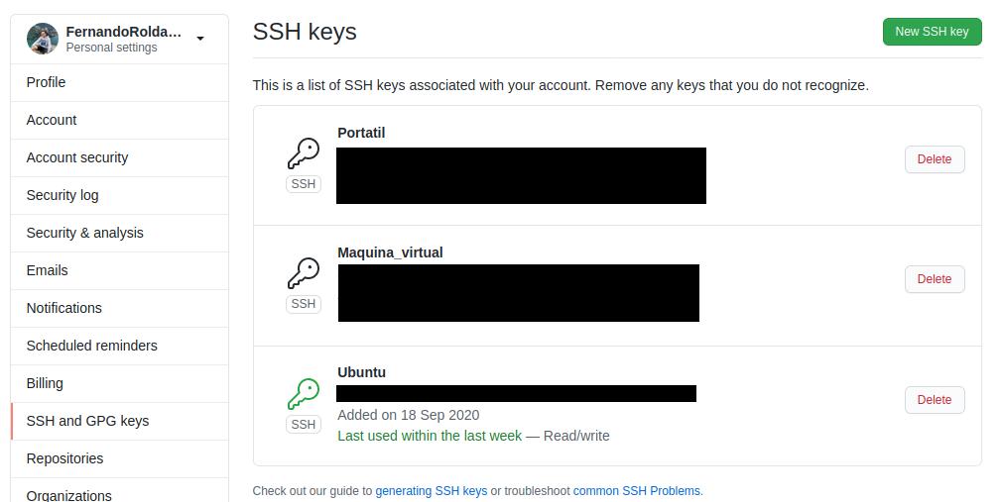
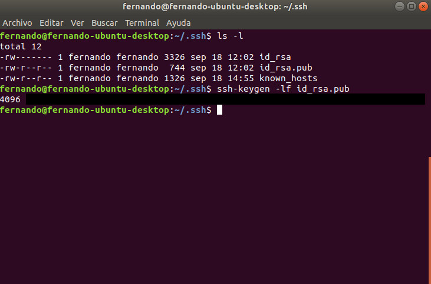
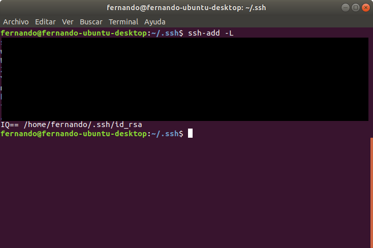
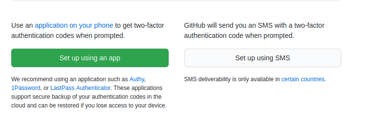

# Project initial set-up
This document pretends to be an explanation on how this repository and this project in general has been initialized, including the initial set-up in the local environment.

## Creation of the different repositories
This task was extremely easy being just to create 3 different repositories in the github page. Another option was to create them using [github-cli](https://cli.github.com/) but because of the tool is quite new, creation of repositories is easier in the github page.
Those repositories can be found on the links listed below:

- [Project repository](https://github.com/FernandoRoldan93/CC-Project): In this repository we are going to store the whole project, and we will document all about it in there.
- [Self-evaluation repository](https://github.com/FernandoRoldan93/Ejercicios-CC): In Spanish, this repository is not directly related with the project, it is focused on solve problems in order to self evaluate my knowledge.
- [Fork of the subject repository](https://github.com/FernandoRoldan93/CC-20-21): This fork will be used to send the solutions to the professor making pull request to his [repository](https://github.com/JJ/CC-20-21).

## Creation of the SSH keys
To create and configure the SSH keys in our Github profile we have to create them first in our computer and them add them to our profile. The whole process is specified in the following [link](https://docs.github.com/en/free-pro-team@latest/github/authenticating-to-github/generating-a-new-ssh-key-and-adding-it-to-the-ssh-agent).
Before starting this project I already had this step completed, so in the following images I will show how I check if everything is ready to work.

Firstly we can go to the settings page on github, to the tab "SSH and GPG keys". There we will see all the ssh keys we added to our profile.



Under the name of the key, we see its fingerprint that has to be the same than the one we will calculate on our local public key. The calculation of that fingerprint is shown below:



Also, we have to check if that key is added to the ssh-agent:



With this 3 steps we can see that everything is working.

## Adding remotes
Another step is to add the remote for the forked repository. To do so you only has to introduce the next line on your terminal:
```
git remote add upstream https://github.com/JJ/CC-20-21.git
```

You can also check all your tracked repositories with the next line:

```
git remote -v
```
## Configuring git options
In this part we are going to configure the default options or settings of our local installation of git. This configuration will include name, email and rebase as default. By adding them we are telling Github who is sending the changes.

This three settings can be done with the following lines:
```
git config --global user.name "Name"
git config --global user.email name@example.com
git config --global pull.rebase true
```
In case we only want to add the rebase option to one repository we just has to change the "--global" option for "--local"

## Two Factors authentication
The last step, but not the less important, is to add a two-factor authentication method to our Github account. This will add another security layer to our account so I highly recommend to add it to your account. To do so you only have to navigate to your Github account and then go to settings > Account security and press in the **Enable two-factor authentication** button. Then chose between the option you want and continue, from here is just a matter of press **next** buttons.




With this, all the necessary configuration is done and we can start working in our project.
